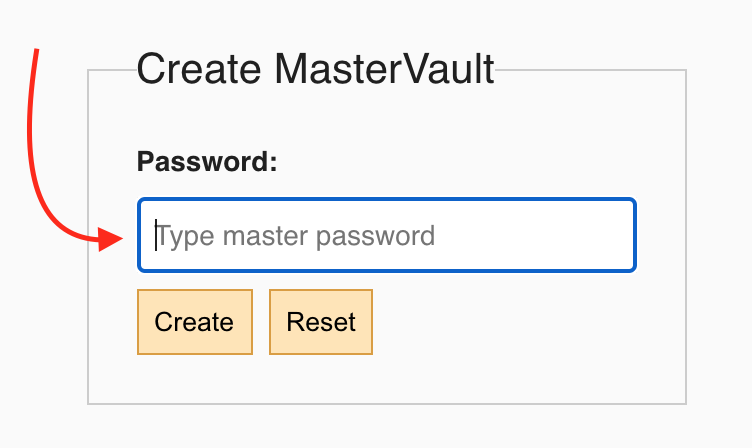
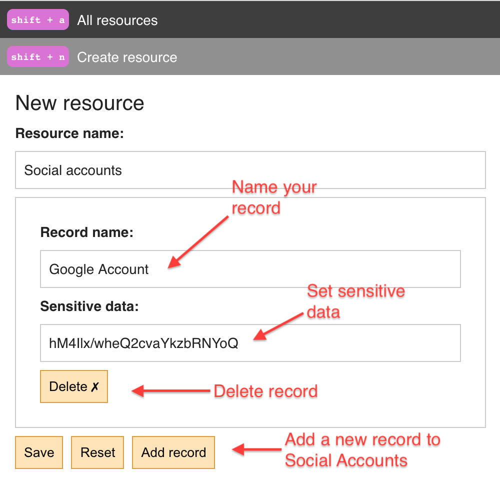
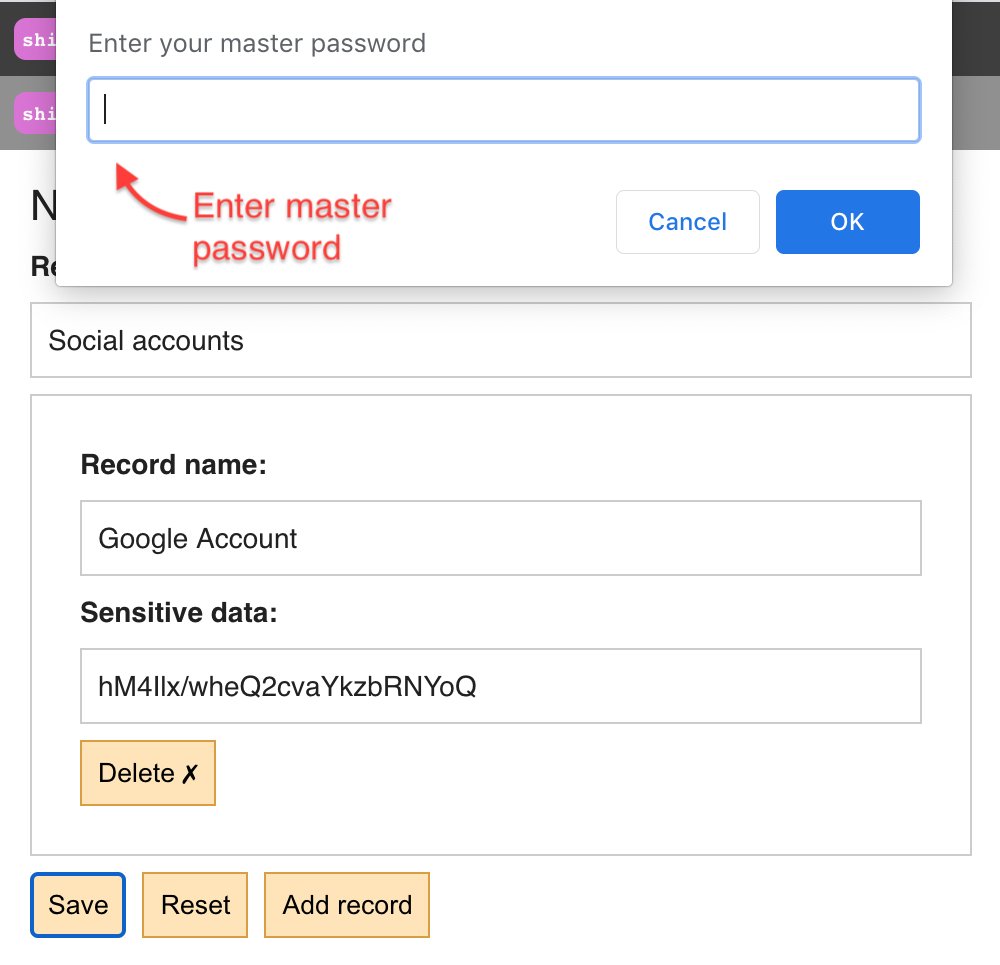
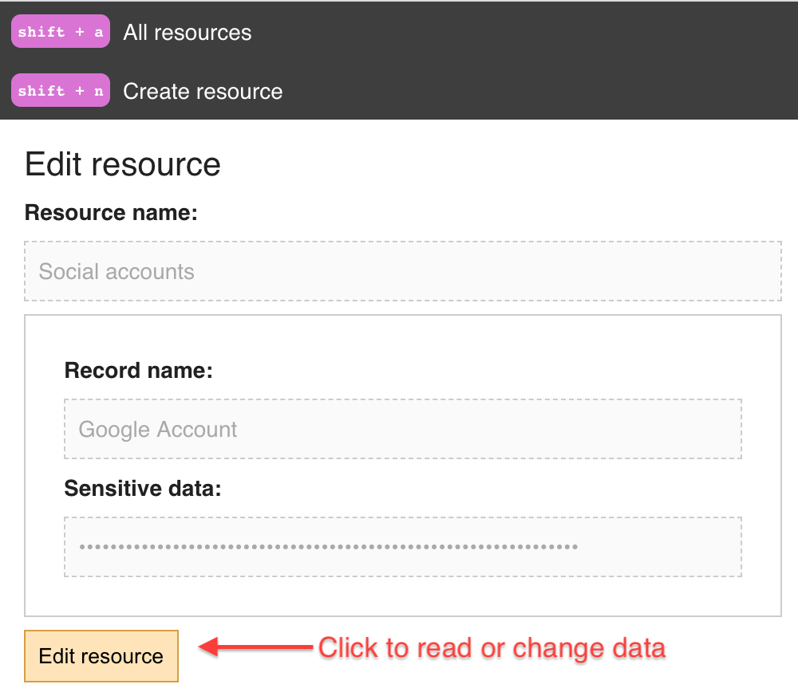
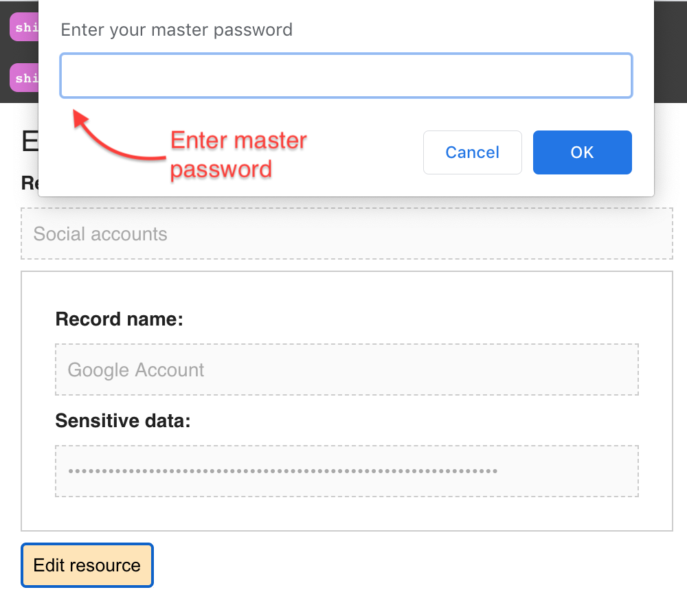
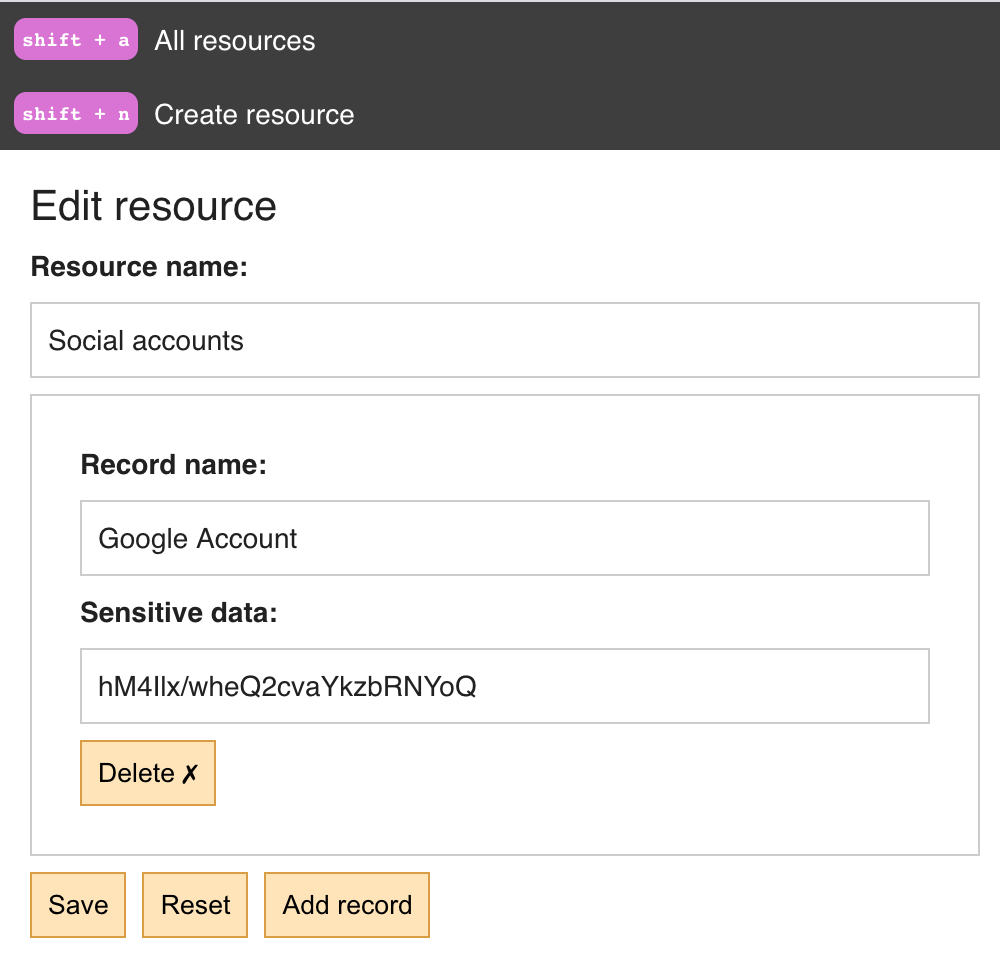
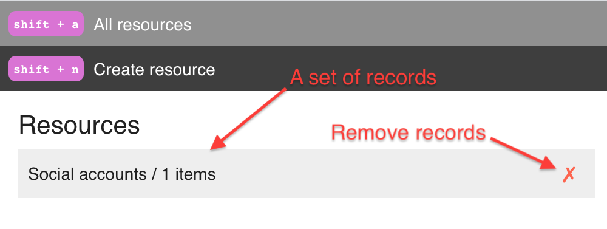
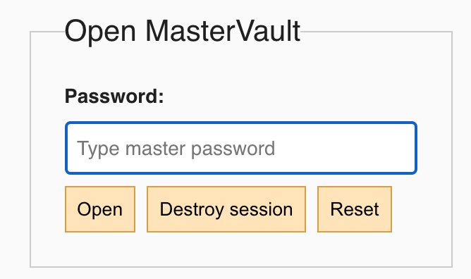

# Offline encryption tool using Advanced Encryption Standard

## Usage

Create a vault by setting a master password

Navigate `Create resource`. Set data that you want to encrypt into `Sensitive data` field. Give a name to your record. Click `Save` button

Enter your master password to confirm the change. The password is bound to the encrypted session.

> All data is encrypted using [cipher](src/utils/cipher.js) and persisted in the localStorage

To read the encrypted data click `Edit resource`

Enter your master password

View your data

To view all records navigate `All resources`

To logout refresh or close the page

> You may also destroy your data by clicking `Destroy session`

